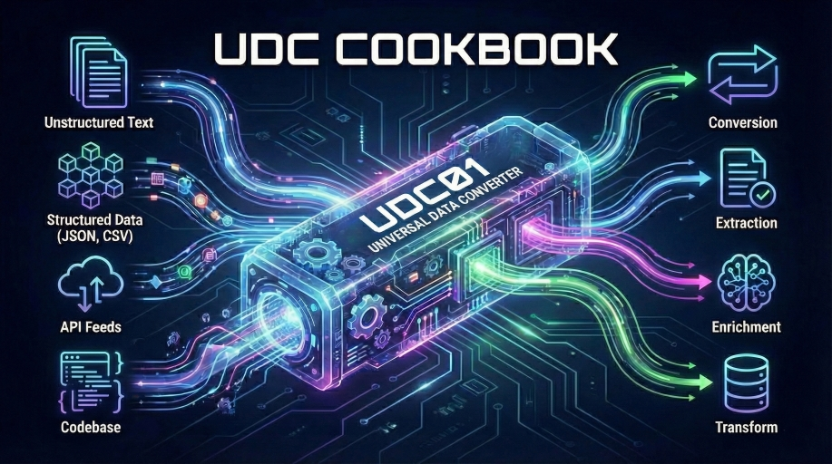

# UDC-Cookbook

This repository is a practical cookbook for [UDC01](https://github.com/IDXNow/UDC01): copy a recipe, point it at your file, and get production-ready output fast.  Each recipe is self-contained with YAML configuration, sample input, expected output, and focused documentation so that anyone can run and extend patterns without setup fatigue.

These recipes are starting points, not constraints.  You'll see clear baseline patterns so you can customize mappings, prompts, schemas, and validation rules without reverse-engineering the framework first.

**What is UDC01?** Universal Data Converter is an AI-driven transformation framework that runs conversion, verification, and validation with a 2/3 majority voting mechanism.  That design gives us higher consistency on ambiguous source data and less manual cleanup work downstream.  See the [UDC01 README](https://github.com/IDXNow/UDC01) for full details.

## I Have a File and I Need It Converted

This section answers the fastest path-to-value question: "I have a file right now, what command should I run?"  Every recipe supports single-file and batch mode so the same pattern works for testing and production runs.

**PDF** - *stop retyping documents by hand*
```bash
python udc01.py --conversion "extraction/pdf-to-json/gift_order_pdf_conv.yaml" \
                --file "path/to/your/document.pdf"
# Or batch-convert a whole folder:
python udc01.py --conversion "extraction/pdf-to-json/gift_order_pdf_conv.yaml" \
                --folder "path/to/your/pdfs" --pattern "*.pdf"
```
-> [Full recipe details](extraction/pdf-to-json/)

**EDI 835 (Healthcare Remittance)** - *turn cryptic remittance files into clean JSON*
```bash
python udc01.py --conversion "conversion/edi835-to-json/edi835_to_json_remittance_conv.yaml" \
                --file "path/to/your/remittance.edi"
# Or batch:
python udc01.py --conversion "conversion/edi835-to-json/edi835_to_json_remittance_conv.yaml" \
                --folder "path/to/your/edi-files" --pattern "*.edi"
```
-> [Full recipe details](conversion/edi835-to-json/)

**EDI 856 (Advance Ship Notice)** - *make sense of shipping notifications*
```bash
python udc01.py --conversion "conversion/edi856-to-json/edi856_to_json_conv.yaml" \
                --file "path/to/your/asn.edi"
# Or batch:
python udc01.py --conversion "conversion/edi856-to-json/edi856_to_json_conv.yaml" \
                --folder "path/to/your/edi-files" --pattern "*.edi"
```
-> [Full recipe details](conversion/edi856-to-json/)

**ACH/NACHA (Payment File)** - *decode fixed-width payment records into readable JSON*
```bash
python udc01.py --conversion "conversion/ach-to-json/nacha_ach_enrichment_conv.yaml" \
                --file "path/to/your/payroll.ach"
# Or batch:
python udc01.py --conversion "conversion/ach-to-json/nacha_ach_enrichment_conv.yaml" \
                --folder "path/to/your/ach-files" --pattern "*.ach"
```
-> [Full recipe details](conversion/ach-to-json/)

**Customer Reviews -> Sentiment Analysis** - *convert and understand in one step*
```bash
python udc01.py --conversion "enrichment/sentiment-analysis/product_review_sentiment_conv.yaml" \
                --file "path/to/your/reviews.csv"
# Or batch:
python udc01.py --conversion "enrichment/sentiment-analysis/product_review_sentiment_conv.yaml" \
                --folder "path/to/your/reviews" --pattern "*.csv"
```
-> [Full recipe details](enrichment/sentiment-analysis/)

**Support Tickets -> Auto-Triage** - *categorize, prioritize, and route automatically*
```bash
python udc01.py --conversion "enrichment/ticket-categorization/support_ticket_triage_conv.yaml" \
                --file "path/to/your/tickets.csv"
# Or batch:
python udc01.py --conversion "enrichment/ticket-categorization/support_ticket_triage_conv.yaml" \
                --folder "path/to/your/tickets" --pattern "*.csv"
```
-> [Full recipe details](enrichment/ticket-categorization/)

<details>
<summary><strong>More formats: CSV, XML, Excel, HTML, bank transactions, math formulas, SQL</strong></summary>

**CSV -> Pipe-delimited**
```bash
python udc01.py --conversion "conversion/csv-to-pipe/sales_invoice_conv.yaml" \
                --file "path/to/your/data.csv"
# Or batch:
python udc01.py --conversion "conversion/csv-to-pipe/sales_invoice_conv.yaml" \
                --folder "path/to/your/csvs" --pattern "*.csv"
```
-> [Full recipe details](conversion/csv-to-pipe/)

**XML -> Pipe-delimited**
```bash
python udc01.py --conversion "conversion/xml-to-pipe/product_inventory_conv.yaml" \
                --file "path/to/your/data.xml"
# Or batch:
python udc01.py --conversion "conversion/xml-to-pipe/product_inventory_conv.yaml" \
                --folder "path/to/your/xml-files" --pattern "*.xml"
```
-> [Full recipe details](conversion/xml-to-pipe/)

**Excel -> Pipe-delimited**
```bash
python udc01.py --conversion "conversion/xlsx-to-pipe/customer_order_conv.yaml" \
                --file "path/to/your/spreadsheet.xlsx"
# Or batch:
python udc01.py --conversion "conversion/xlsx-to-pipe/customer_order_conv.yaml" \
                --folder "path/to/your/spreadsheets" --pattern "*.xlsx"
```
-> [Full recipe details](conversion/xlsx-to-pipe/)

**HTML -> CSV**
```bash
python udc01.py --conversion "conversion/html-to-csv/job_listing_conv.yaml" \
                --file "path/to/your/page.html"
# Or batch:
python udc01.py --conversion "conversion/html-to-csv/job_listing_conv.yaml" \
                --folder "path/to/your/pages" --pattern "*.html"
```
-> [Full recipe details](conversion/html-to-csv/)

**HTML -> JSON**
```bash
python udc01.py --conversion "extraction/html-to-json/real_estate_listing_conv.yaml" \
                --file "path/to/your/page.html"
# Or batch:
python udc01.py --conversion "extraction/html-to-json/real_estate_listing_conv.yaml" \
                --folder "path/to/your/pages" --pattern "*.html"
```
-> [Full recipe details](extraction/html-to-json/)

**Bank Transactions -> Classified**
```bash
python udc01.py --conversion "enrichment/transaction-classification/business_transaction_categorize_conv.yaml" \
                --file "path/to/your/transactions.csv"
# Or batch:
python udc01.py --conversion "enrichment/transaction-classification/business_transaction_categorize_conv.yaml" \
                --folder "path/to/your/exports" --pattern "*.csv"
```
-> [Full recipe details](enrichment/transaction-classification/)

**Math Formulas -> LaTeX / MathML** - *turn plain-notation formulas into publishable markup*
```bash
python udc01.py --conversion "conversion/math-to-latex/math_formula_latex_conv.yaml" \
                --file "path/to/your/formula.txt"
# Or batch a whole formula library:
python udc01.py --conversion "conversion/math-to-latex/math_formula_latex_conv.yaml" \
                --folder "path/to/your/formulas" --pattern "*.txt"
```
-> [LaTeX recipe](conversion/math-to-latex/) - [MathML recipe](conversion/math-to-mathml/)

</details>

## Categories

These categories are organized by outcome, not by file type, so teams can choose the right pattern based on the business problem they are solving.

| Category | Recipes | Description |
|---|---|---|
| [conversion/](conversion/) | 10 | Format A to Format B - CSV, XML, Excel, HTML, JSON, EDI, ACH, math notation |
| [extraction/](extraction/) | 2 | Unstructured content to structured JSON - HTML pages, PDF documents |
| [enrichment/](enrichment/) | 3 | Convert and augment records with AI insight (sentiment, categorization, classification) |
| [code-transform/](code-transform/) | 1 | Code-to-code transformations - SQL view restructuring |

## All Recipes

Use this table as a build menu.  It tells you what each recipe consumes, what it produces, and what operational job it is designed to handle.

| Recipe | Input | Output | Category |
|---|---|---|---|
| [csv-to-pipe](conversion/csv-to-pipe/) | CSV | Pipe | Sales invoice conversion |
| [xml-to-pipe](conversion/xml-to-pipe/) | XML | Pipe | Product inventory from nested XML |
| [xlsx-to-pipe](conversion/xlsx-to-pipe/) | Excel | Pipe | Customer orders with date/number formatting |
| [html-to-csv](conversion/html-to-csv/) | HTML | CSV | Job listing extraction from web pages |
| [edi856-to-json](conversion/edi856-to-json/) | EDI 856 | JSON | Advance Ship Notice with HL loop hierarchy parsing |
| [edi835-to-json](conversion/edi835-to-json/) | EDI 835 | JSON | Healthcare Remittance Advice with AI-enriched code descriptions |
| [ach-to-json](conversion/ach-to-json/) | ACH/NACHA | JSON | Fixed-width payment file with decoded transaction codes and bank identification |
| [json-to-csv](conversion/json-to-csv/) | JSON | CSV | CRM contacts with nested address and phone array flattening |
| [math-to-latex](conversion/math-to-latex/) | Text | LaTeX | Plain math notation to render-ready LaTeX |
| [math-to-mathml](conversion/math-to-mathml/) | Text | MathML | Plain math notation to Presentation MathML |
| [html-to-json](extraction/html-to-json/) | HTML | JSON | Real estate listing with nested structure |
| [pdf-to-json](extraction/pdf-to-json/) | PDF | JSON | Order document with line items and totals |
| [sentiment-analysis](enrichment/sentiment-analysis/) | CSV | Pipe | Customer reviews enriched with sentiment, score, topics, urgency |
| [ticket-categorization](enrichment/ticket-categorization/) | CSV | Pipe | Support tickets enriched with category, priority, routing, emotion |
| [transaction-classification](enrichment/transaction-classification/) | CSV | Pipe | Bank transactions enriched with category, tax flag, vendor, GL code |
| [sql-view-customer-join](code-transform/sql-view-customer-join/) | SQL | SQL | Add customer name lookup to views via INNER JOIN to d_customer |

## Quick Start

This section gets you from clone to first successful run with the least friction.

1. **Install and configure UDC01** - Follow the [UDC01 setup guide](https://github.com/IDXNow/UDC01) to install dependencies and configure your LLM provider.  Copy [_shared/sample_configs/default_config.json](_shared/sample_configs/default_config.json) to your UDC01 config location and set your default model profile.  We keep cloud and local options in one config so teams can switch environments without rewriting recipes.

2. **Clone this cookbook:**
   ```bash
   git clone https://github.com/IDXNow/UDC-Cookbook.git
   ```

3. **Run a recipe:**
   ```bash
   python udc01.py --conversion "UDC-Cookbook/conversion/csv-to-pipe/sales_invoice_conv.yaml" \
                   --file "UDC-Cookbook/conversion/csv-to-pipe/sales_invoice.csv"
   ```

Once UDC01 is configured, there is no per-recipe setup.  That is deliberate: a consistent runtime contract across recipes reduces onboarding time and operational mistakes.

**Building a recipe for a format we don't cover yet?**  UDC01 ships with **UDC-Studio**, a Streamlit app that profiles your data and generates a starting conversion YAML you can then refine into a recipe.  It is a builder, not a runner - you download the YAML and run it with `udc01.py` as usual.

```bash
pip install -r requirements_studio.txt
python udc_studio.py
```

See the [UDC-Studio Guide](https://github.com/IDXNow/UDC01/blob/main/UDC-STUDIO.md) for the walkthrough.

## Configuration

A sample configuration file is provided in [_shared/sample_configs/](_shared/sample_configs/).  This section exists so you can tune reliability, speed, and cost with clear levers instead of trial and error.

- **default_config.json** - Includes provider profiles for OpenAI, Anthropic, Google, LM Studio, and Ollama.  Set `default_provider` at the top level, or override per agent-group or per individual agent.  API keys are resolved from environment variables (`${OPENAI_API_KEY}`, `${ANTHROPIC_API_KEY}`, `${GOOGLE_API_KEY}`), which keeps secrets out of recipe files.

Key configuration options (UDC01 v1.0.1):

| Setting | Where | Description |
|---|---|---|
| `default_provider` | top-level or agent-group | Which provider profile to use by default |
| `provider` / `model` / `temperature` | individual agent | Per-agent overrides (highest priority) |
| `reasoning_effort` | provider profile, agent-group, or agent | Reasoning depth - works across **all** providers (Anthropic, Google, OpenAI, and local endpoints on the OpenAI wire format).  Accepted values vary by vendor, spanning `none` / `minimal` / `low` / `medium` / `high` / `xhigh` / `max` |
| `thinking_budget` | provider profile, agent-group, or agent | *Legacy* token budget for extended thinking.  Still works on older Anthropic and Google models; current Claude models reject it - use `reasoning_effort` instead.  Setting both makes `reasoning_effort` win, with a warning in the log |
| `max_tokens` / `default_max_tokens` | agent / profile or group | Max output tokens per call.  On reasoning models this covers thinking **and** output, so set it high enough for both |
| `supports_temperature` | provider profile or agent | Set `false` for models that reject a `temperature` parameter |
| `token_param` | provider profile or agent | Name of the token-limit field on the wire (OpenAI needs `max_completion_tokens`) |
| `include_prior_output_on_retry` | top-level | `true` feeds the previous failed output back to the conversion agent on retry, alongside the validator error messages (default: `false`).  Overridable per recipe and at the command line - see below |
| `parallel_agents` | top-level | `true` to run verification/validation agents concurrently |
| `max_parallel_workers` | top-level | Max concurrent agent threads (default: `2`) |
| `api_timeout` | top-level | API call timeout in seconds (default: `600`) |
| `file_extension` in `file_save` | top-level | Set to `xlsx` to save tabular output as an Excel workbook |

Provider, model, and the reasoning settings all resolve most-specific-first: individual agent, then role-group, then provider profile, then global.  See the [UDC01 Configuration Hierarchy Guide](https://github.com/IDXNow/UDC01/blob/main/CONFIGURATION.md) for the full resolution order.

### Recipe-Level Runtime Keys

A conversion YAML is not limited to prompts - two top-level keys let a recipe carry its own runtime behavior, so a pattern that needs different handling does not force a global config change.

**Skip pre-conversion verification** when the source data's quality is already guaranteed (machine-generated files from a controlled system, for example).  This saves up to three agent calls per file:

```yaml
verification:
  enabled: false
```

With verification off, `data_verification_system_msg` and `data_verification_request_msg` are no longer required and the pipeline goes straight to conversion.  Omit the block entirely to keep the default 2/3 verification consensus.

**Feed the prior output back on retry** for complex conversions that converge faster when the agent can see what it produced and why the validators rejected it:

```yaml
include_prior_output_on_retry: true
```

This overrides the config file for that recipe only.  The CLI still wins over both - `--include-prior-output-on-retry` forces it on, `--no-include-prior-output-on-retry` forces it off, and omitting the flag defers to the recipe and then the config.

### Self-Hosted and Custom Endpoints

The `local` provider profile is a bring-your-own-endpoint slot, not a localhost-only setting.  Anything speaking the OpenAI chat-completions format works through it: LM Studio (`http://localhost:1234`), Ollama (`http://localhost:11434`, now a built-in profile), vLLM, llama.cpp, a LiteLLM proxy, or Azure OpenAI.  Provider names are arbitrary keys, so copy the profile and rename it when pointing at more than one endpoint.

Two things to get right:

- **Off localhost you need credentials.**  Add `auth_header` (plus `auth_prefix`) to the profile and an entry in `api_keys` keyed by the provider name.  Leave `auth_header` as `null` for LM Studio and Ollama and UDC01 sends nothing.
- **Model IDs go over the wire verbatim.**  Namespaces are part of the name - copy them from `lms ls` or `ollama list` rather than trimming them.

Reasoning-capable local models need output headroom: the shipped profiles set `default_max_tokens` to 16000 so the model has room to think *and* answer.  Set it too low and you get an empty response.  See [Custom Endpoints](https://github.com/IDXNow/UDC01/blob/main/CONFIGURATION.md#custom-endpoints-the-local-profile) in the UDC01 config guide for the full contract, including AWS Bedrock (which needs a signing proxy).

See the [UDC01 configuration docs](https://github.com/IDXNow/UDC01#cloud-provider-configuration) for full setup details.

## Troubleshooting

When something breaks, go to [TROUBLESHOOTING.md](TROUBLESHOOTING.md). It is organized around the errors teams hit in real runs and how we resolve them quickly.

## Repository Structure

```
UDC-Cookbook/
├── README.md
├── CONTRIBUTING.md
├── TROUBLESHOOTING.md
├── recipes.yaml
├── conversion/              # Format A -> Format B
│   ├── csv-to-pipe/
│   ├── xml-to-pipe/
│   ├── xlsx-to-pipe/
│   ├── html-to-csv/
│   ├── edi856-to-json/
│   ├── edi835-to-json/
│   ├── ach-to-json/
│   ├── json-to-csv/
│   ├── math-to-latex/
│   └── math-to-mathml/
├── extraction/              # Unstructured -> Structured
│   ├── html-to-json/
│   └── pdf-to-json/
├── enrichment/              # Convert + augment with AI insight
│   ├── sentiment-analysis/
│   ├── ticket-categorization/
│   └── transaction-classification/
├── code-transform/          # Code-to-code transformation
│   └── sql-view-customer-join/
├── _shared/                 # Reusable configs and utilities
└── _template/               # Blank recipe starter
```

## Adding a New Recipe

See [CONTRIBUTING.md](CONTRIBUTING.md) for the contribution workflow and use [_template/](_template/) as your starting point. We use a template-first approach so new recipes stay consistent and easier to operate.

## License

Copyright (c) 2026 Steve Wint / I D X - [MIT License](LICENSE)


